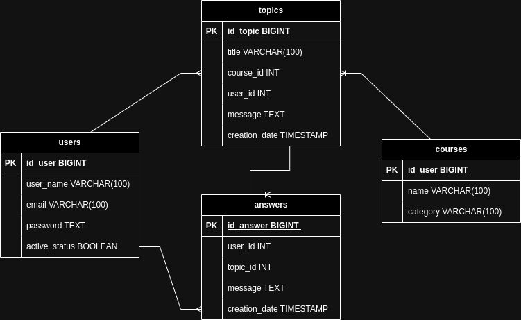

# REST API Foro Hub Challenge

# Index
- [API Documentation.](#api-documentation)
- [Description.](#description)
- [Challenges faced in the project.](#challenges)
- [Technology Stack.](#technology-stack)
- [Project Monitoring.](#project-monitoring)

### API Documentation:
Link:

### Description:
This project is a REST API for a forum where participants
of a platform can post their questions about certain topics.
This API was developed in Java with Spring Boot and a 
PostgreSQL database and is part of the specialization in 
backend with Java and Spring Framework of the ONE - Oracle
Next Education program.

- ERD Database:

## Project Monitoring:
1. Create Spring Boot project.
2. Create packages.
3. Configure database connection.
4. Configure aplication.properties profiles.
5. Test the configuration with a controller.
6. Create GitHub repository.
7. Create database.
8. Create flyway migration.
9. Make ERD diagram.
10. Create the new endpoint to create a topic.
11. Add bussines rules.
12. Add validations and exceptions.
13. Create the new endpoint to update a topic.
14. Create the new endpoint to show topics.