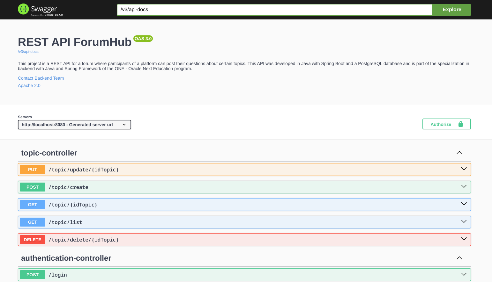
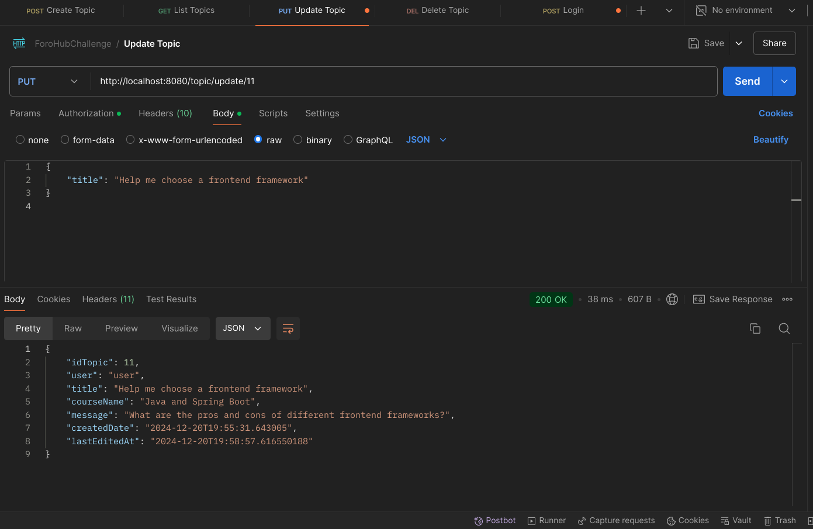
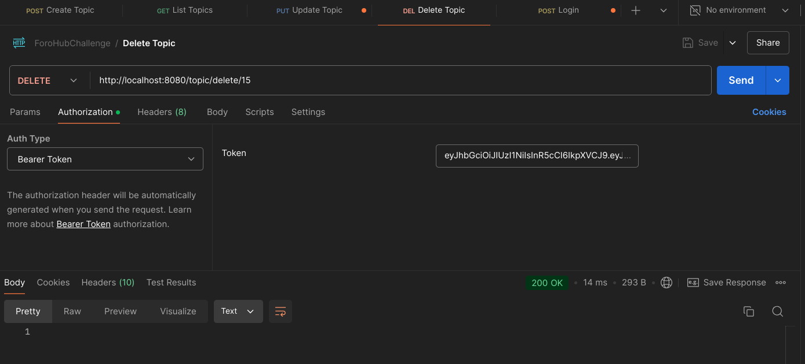
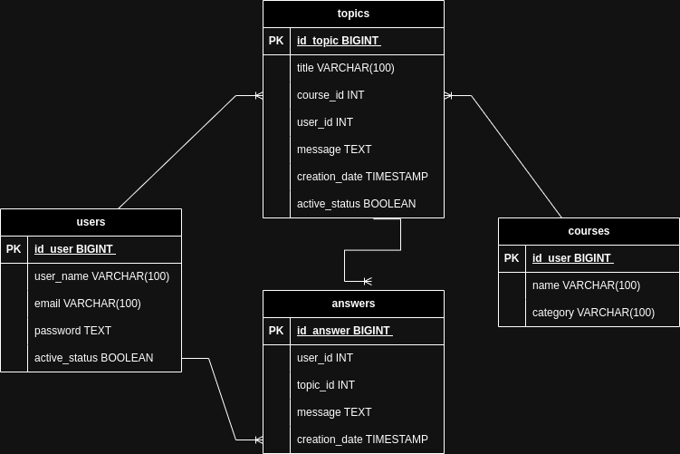

# REST API Forum Hub Challenge

# Index
- [API Documentation.](#api-documentation)
- [Description.](#description)
- [Challenges faced in the project.](#challenges)
- [Technology Stack.](#technology-stack)
- [Project Monitoring.](#project-monitoring)

### API Documentation:
- Swagger Documentation:

### Description:
This project is a REST API for a forum where participants
of a platform can post their questions about certain topics.
This API was developed in Java with Spring Boot and a 
PostgreSQL database and is part of the specialization in 
backend with Java and Spring Framework of the ONE - Oracle
Next Education program.

- Create new topic:

The API offers functionality to create a topic, view forum 
topics, and update or delete an existing topic.

It features validators that check whether the data the user 
wants to insert, update, or delete complies with established
business rules.

- List of topics:

Additionally, the API includes support for data pagination,
which allows you to efficiently manage the display of the 
entire list of topics without exceeding the amount of data
displayed in a single query.

- Update topic:

- Delete a topic:

The API uses a PostgreSQL database to manage and
store all relevant information.

The main components stored in the database are:

- Users: This table contains the data of users
registered in the system, such as names, emails, encrypted
passwords, and any other relevant information.
  
- Created Topics: This is where topics or questions created
by users in the forum are stored. Each topic includes 
information such as the topic title, the content of the message,
the user ID who created it, the creation date, and categories
to facilitate organization and searching.
  
- Courses: This table stores information about the different
courses offered. Each course has a unique identifier, a title, 
and a description.
  
- Answers related to each topic: Answers to the topics are stored
in this table. Each reply contains the content of the message, 
the ID of the user who responded, the ID of the topic to which 
the reply is being replied, the date the reply was created, and 
any additional information that may be necessary for the context 
of the discussion.
  

- ERD Database:

## Project Monitoring:
1. Create Spring Boot project.
2. Create packages.
3. Configure database connection.
4. Configure aplication.properties profiles.
5. Test the configuration with a controller.
6. Create GitHub repository.
7. Create database.
8. Create flyway migration.
9. Make ERD diagram.
10. Create the new endpoint to create a topic.
11. Add bussines rules.
12. Add validations and exceptions.
13. Create the new endpoint to update a topic.
14. Create the new endpoint to show topics.
15. Add global handling exceptions.
16. Add Spring Security dependency.
17. Configure stateless application.
18. Add JWT dependency.
19. Generate JWT.
20. Test authentication and authorization.